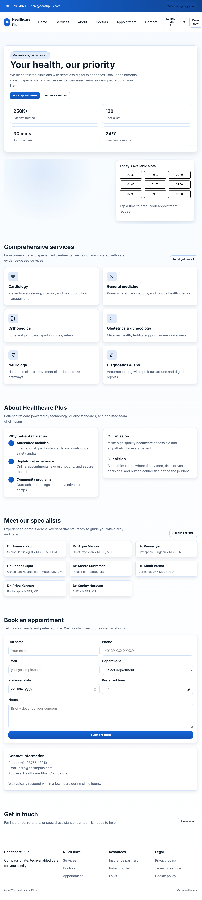

<div align="center">

# 🏥 Healthcare Plus

### Responsive Healthcare Web Application

A modern healthcare web application developed as a final-year academic project using **HTML5, CSS3, JavaScript (ES6), Firebase Authentication, Cloud Firestore, and Netlify**. The application enables users to explore healthcare services, register securely, and submit appointment requests through an intuitive web interface.

🌐 **Live Demo:** https://healthcareplus-webapp.netlify.app/


</div>

---

# 📑 Table of Contents

- Overview
- Features
- Technologies Used
- Live Demo
- Screenshot
- My Contributions
- Project Structure
- Getting Started
- Future Improvements
- Project Status
- Author

---

# 📖 Overview

Healthcare Plus is a responsive healthcare web application designed to simplify the process of discovering healthcare services and booking appointments. The application provides secure user authentication, appointment request submission, and an admin dashboard for managing application data. It delivers a clean and user-friendly experience across desktop and mobile devices.

---

# ✨ Features

- 🏥 Browse healthcare services
- 👨‍⚕️ View doctor profiles
- 🔐 Secure user registration and login using Firebase Authentication
- 📅 Submit appointment requests through an online booking form
- ☁️ Store and retrieve user information using Cloud Firestore
- 👨‍💼 Secure admin dashboard for managing application data
- 📱 Fully responsive design for desktop and mobile devices
- 🎨 Clean and intuitive user interface

---

# 🛠 Technologies Used

- HTML5
- CSS3
- JavaScript (ES6)
- Firebase Authentication (Email & Password)
- Cloud Firestore
- Netlify
- AI-assisted development tools

---

# 🌐 Live Demo

https://healthcareplus-webapp.netlify.app/

---

# 📸 Screenshot



---

# 👨‍💻 My Contributions

- Designed and developed the appointment booking and healthcare service workflows.
- Built a responsive user interface using HTML5, CSS3, and JavaScript (ES6).
- Implemented secure user authentication using Firebase Authentication (Email & Password).
- Integrated Cloud Firestore to securely store and retrieve user data.
- Developed an admin dashboard for managing application data.
- Used AI-assisted development tools to support development and improve productivity.
- Performed manual functional testing to identify and resolve usability issues.
- Deployed the application on Netlify.

---

# 📁 Project Structure

```text
healthcareplus/
│
├── index.html
├── css/
├── js/
├── images/
├── home.png
└── README.md
```

---

# 🚀 Getting Started

1. Clone the repository

```bash
git clone https://github.com/pasumbonpechi01/healthcareplus.git
```

2. Open the project folder.

3. Configure Firebase credentials.

4. Open `index.html` in your browser.

---

# 🔮 Future Improvements

- Online payment integration
- Email notifications
- Appointment approval workflow
- Medical records management
- Video consultation support
- Multi-language support
- Analytics dashboard
- Role-based access control

---

# 📌 Project Status

✅ Completed as a Final-Year Academic Project (2025–2026)

---

# 👤 Author

**Pasumbonpechi**

🎓 B.Com Information Technology Graduate

GitHub: https://github.com/pasumbonpechi01

Live Demo: https://healthcareplus-webapp.netlify.app/

---

<div align="center">

⭐ Thank you for visiting this project!

</div>
